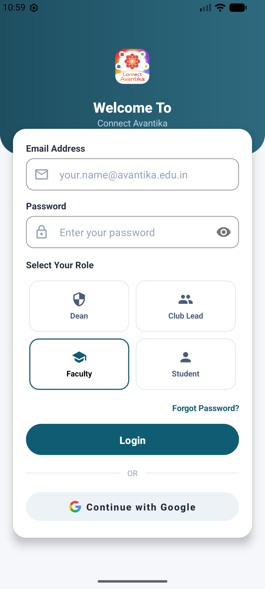
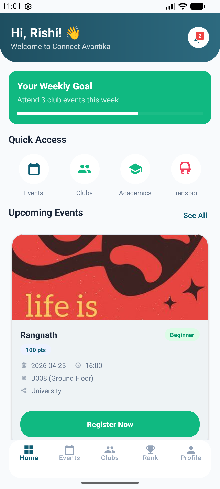
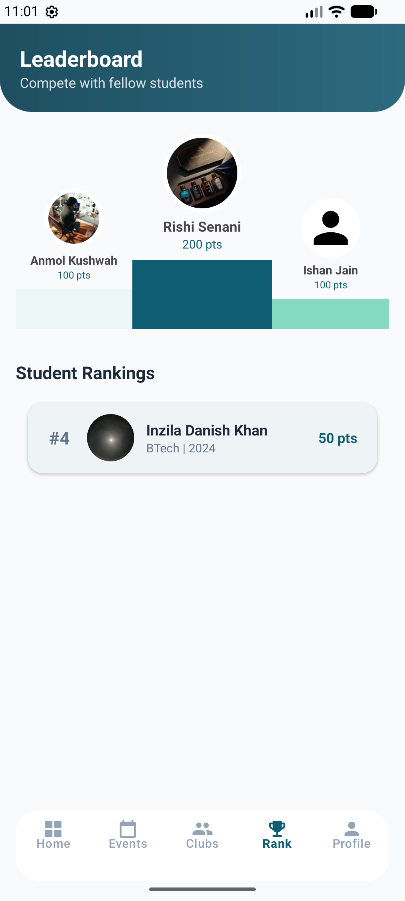
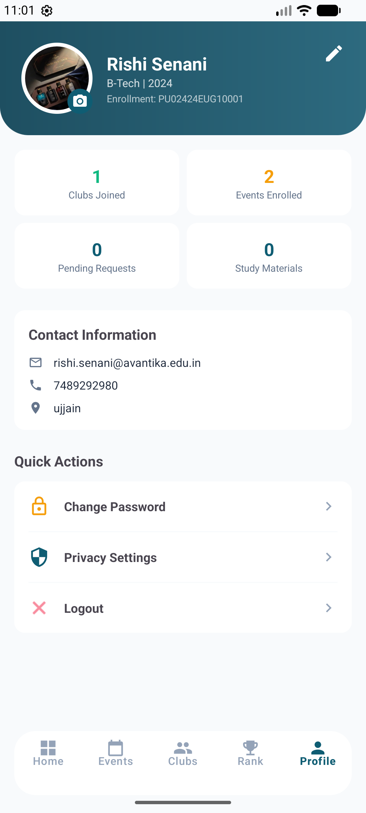
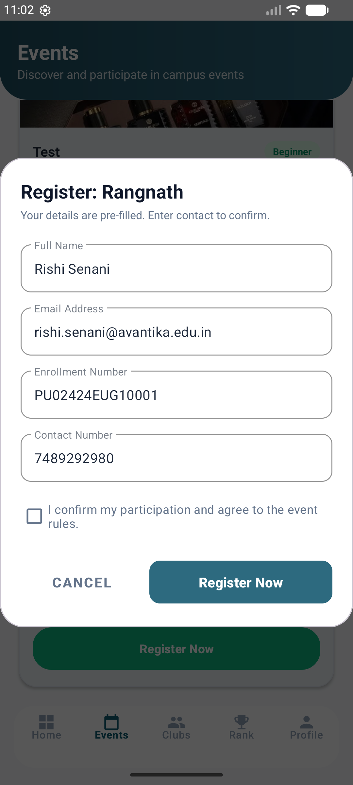
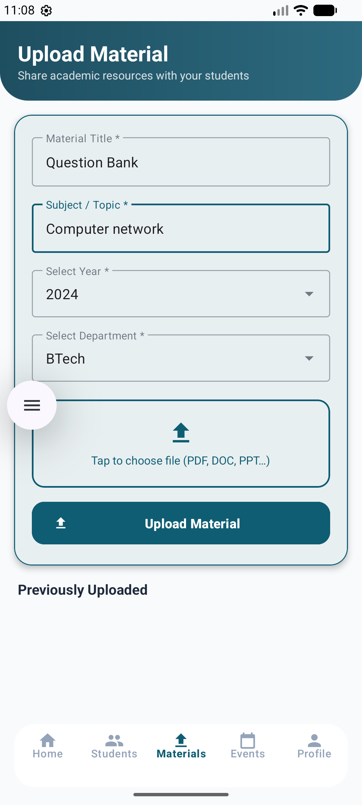

# Avantika Connect - University Management System

### Problem Description
Avantika Connect is a comprehensive mobile solution designed to bridge the communication gap within a university ecosystem. It streamlines the often chaotic process of club management, event organization, and academic resource sharing. By centralizing event approvals for deans, membership requests for club heads, and study material access for students into a single, role-based platform, the app eliminates administrative bottlenecks and ensures students never miss important campus activities through integrated push notifications and real-time updates.

---

### Team Members & Roles

| **Team Member**       | **Role(s)**                     | **Key Responsibilities**                                                                                                                                                                    |
| --------------------- | ------------------------------- | ------------------------------------------------------------------------------------------------------------------------------------------------------------------------------------------- |
| **Naman Patel**       | Tech Stack & Backend Developer  | Tech stack selection, backend development, database management, API integration                                                                                                             |
| **Vaishnavi Solanki** | Documentation & API Integration | Project documentation, report preparation, integration of OneSignal API (push notifications), Google Cloud Services integration |
| **Saloni Patidar**    | Frontend & User Flow Designer   | Frontend development, UI implementation, user flow design, improving user experience                                                                                                        |

---

### Tech Stack
*   **Language:** Kotlin
*   **Framework:** Android SDK (Hybrid: XML View System + Jetpack Compose)
*   **Database:** Supabase (PostgreSQL via Postgrest)
*   **Authentication:** Supabase Auth (with Google Integration support)
*   **Storage:** Supabase Storage (Buckets: `club banner`, `event banner`, `faculty photo`, `student photo`, `study material`)
*   **Push Notifications:** OneSignal API
*   **Networking:** OkHttp & Ktor Client
*   **Libraries:** Navigation Component, Glide (Image Loading), Lottie (Animations), Material Design 3

---

### Setup and Run Instructions

1.  **Clone the Repository:**
    ```bash
    git clone https://github.com/Namanpatel19/Connect-Avantika.git
    ```
2.  **Configuration:**
    Open `local.properties` in the root directory and add your Supabase and OneSignal credentials:
    ```properties
    SUPABASE_URL_S="your_supabase_project_url"
    SUPABASE_PUBLIC_KEY="your_anon_public_key"
    SUPABASE_SERVICE_ROLE_KEY="your_service_role_key"
    ONESIGNAL_REST_API_KEY="your_onesignal_rest_api_key"
    ```
3.  **Sync Gradle:**
    Open the project in Android Studio and click "Sync Project with Gradle Files".
4.  **Build & Run:**
    *   Select an emulator or a physical device (API 24+).
    *   Click the "Run" button or use `./gradlew installDebug`.

---

### Demo Video
[Watch the Demo on YouTube](https://youtube.com/link-to-your-video)

---

### Screenshots








---

### Known Limitations and Future Work

**Known Limitations:**
*   **PDF Export:** Currently supports single-page generation; long registration lists might be truncated.
*   **File Formats:** Viewing study materials relies on system-installed apps for specific extensions (PDF, DOCX).
*   **Offline Mode:** Limited support for data persistence without an active internet connection.

**Future Work:**
*   **In-App Chat:** Real-time messaging between club members and faculty.
*   **Attendance Tracking:** QR-code based attendance for approved events.
*   **Advanced Analytics:** Data visualization for deans to track club participation and academic performance.
*   **Dark Mode:** Comprehensive UI support for system-wide dark theme.
